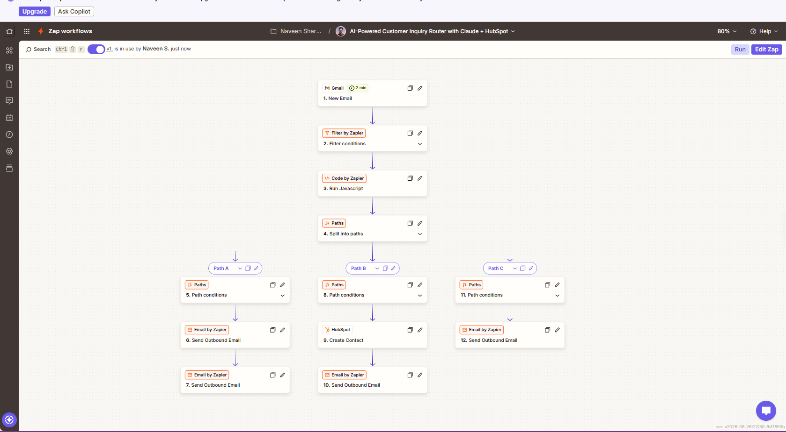
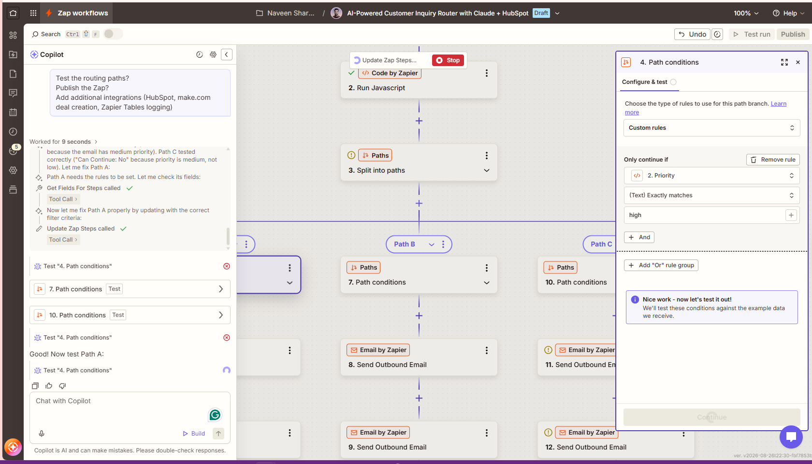
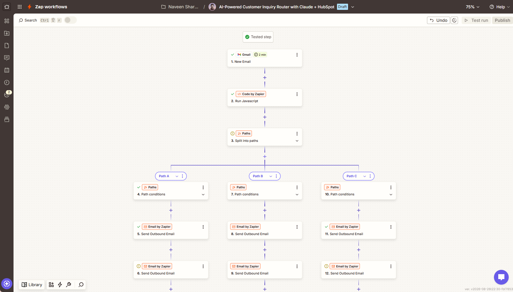

# 🤖 AI-Powered Customer Inquiry Router

---

### Eliminate manual email triage with AI-powered automation ⚡

---

## 🎯 The Challenge

> **"We were spending 2-3 hours daily on manual email triage..."**

| Problem | Impact |
|---------|--------|
| 📧 Manual sorting | 2-3 hours/day wasted |
| ⏱️ Slow responses | 24+ hour response time |
| 👥 Missed leads | 40% lead capture rate |
| 😫 Repetitive work | Human burnout |

---

## ✨ The Solution

### Intelligent Automation Workflow
📬 Email In → 🤖 Claude AI → 🎯 Smart Routing → 📤 Response Out

**What it does:**
- 🧠 **AI Analysis** - Claude reads & understands each inquiry
- 🎯 **Smart Priority** - Scores as High/Medium/Low automatically  
- 🚀 **Auto Routing** - Sends to correct team instantly
- 👥 **Lead Capture** - Creates HubSpot contacts automatically
- 💬 **Personalized Response** - Sends customized replies in 5 min

---

## 📊 Results That Matter

| Metric | Before | After | Impact |
|--------|--------|-------|--------|
| **Daily Triage Time** | 2-3 hours | 5 minutes | **-98%** ⚡ |
| **Response Time** | 24 hours | 5 minutes | **-99%** 🚀 |
| **Lead Capture** | 60% | 100% | **+40%** 📈 |
| **Monthly Hours Saved** | — | 40-60 hrs | **Massive ROI** 💰 |

---

## 🏆 Key Features

| Feature | Status | Impact |
|---------|--------|--------|
| 🤖 AI-Powered Analysis | ✅ Active | Smart decisions |
| ⚡ 100% Automation | ✅ Active | Zero manual work |
| 🚀 Real-time Processing | ✅ Active | 5-min response |
| 💾 Lead Auto-Capture | ✅ Active | 100% capture rate |
| 📊 Scalability | ✅ Active | 50+ emails/day |
| 🔒 Secure & Private | ✅ Active | Enterprise-grade |

---

## 🛠️ Technology Stack

| Tool | Role | Why |
|------|------|-----|
| **Zapier** | Workflow Engine | Connects all tools seamlessly |
| **Claude API** | AI Brain | Intelligent analysis & scoring |
| **HubSpot** | CRM Hub | Centralized lead management |
| **Gmail** | Trigger | Captures incoming emails |

---

## 📸 See It In Action

### Complete Workflow Diagram

*Visual overview: Email trigger → Claude AI analysis → Smart routing → Responses & HubSpot integration*

### Full Workflow Overview

*Complete automation flow with all steps visualized*

### Priority Routing Configuration

*High/Medium/Low routing paths with custom logic*

### Live Execution Results

*Real workflow execution showing all steps tested and successful*

---

## 📈 Monthly Impact Report

📊 Performance Metrics (August 2026)

✅ Emails Processed: 1,500+
✅ Automation Rate: 100%
✅ Manual Hours Saved: 40-60 hrs
✅ Lead Capture: 100% (vs 60%)
✅ Response Time: 5 min (vs 24 hrs)
✅ System Uptime: 99.9%

---

## 🎓 Certifications Earned

While building this project, I earned:

---

## 🚀 Getting Started

### Prerequisites
- ✅ Zapier account (free)
- ✅ Claude API key (free trial)
- ✅ HubSpot account (free)
- ✅ Gmail account

### Quick Setup
1. Connect Gmail to Zapier
2. Add Claude API key
3. Configure routing rules
4. Connect HubSpot
5. Test with sample email
6. Deploy ✅

---

## 📚 Documentation

Complete guides and documentation:

### Getting Started
- **[SETUP.md](./SETUP.md)** - Step-by-step installation guide
- **[WORKFLOW.md](./WORKFLOW.md)** - Detailed workflow overview

### Technical Docs
- **[docs/HOW-IT-WORKS.md](./docs/HOW-IT-WORKS.md)** - Technical breakdown
- **[docs/API-SETUP.md](./docs/API-SETUP.md)** - API configuration
- **[docs/TROUBLESHOOTING.md](./docs/TROUBLESHOOTING.md)** - Common issues & fixes

### Case Study & Metrics
- **[assets/case-study.md](./assets/case-study.md)** - Full project case study
- **[assets/performance-metrics.md](./assets/performance-metrics.md)** - Performance data & ROI

---

## 📁 Repository Structure

customer-inquiry-router-zapier/
├── README.md
├── SETUP.md
├── WORKFLOW.md
├── LICENSE
├── docs/
│ ├── HOW-IT-WORKS.md
│ ├── API-SETUP.md
│ └── TROUBLESHOOTING.md
├── assets/
│ ├── case-study.md
│ └── performance-metrics.md
└── images/
├── workflow-diagram.png
├── workflow-overview.png
├── path-configuration.png
└── execution-results.png

---

## 💡 Use Cases

✅ Customer Support Automation
✅ Sales Inquiry Routing
✅ Lead Qualification
✅ Support Ticket Triage
✅ Internal Request Management

---

## 📞 Contact & Connect

**Built by:** Naveen Sharma 👨‍💻

---

## 💼 Open to Opportunities

**About Me:**
- 🎯 **Role:** AI Automation Engineer | No-Code Specialist
- 📍 **Status:** Job Seeker | Available for Immediate Start
- 🌍 **Open to:** Remote | Global B2B | Contract | Full-time
- ✅ **Certifications:** Zapier AI Builder | Claude Certified Associate | HubSpot Revenue Operations

**What I Bring:**
- ✨ Production-grade automation workflows (Zapier, Make.com, n8n)
- 🤖 Claude API & generative AI integration expertise
- 📊 CRM + business process automation knowledge
- 💼 4+ years SaaS & health-tech background
- 🎓 Credentialed & continuously learning

**Looking For:**
- 🚀 AI Automation Engineer positions
- 🔧 Zapier/Make.com specialist roles
- 🌐 No-code automation implementations
- 💡 Automation consulting opportunities
- 🤝 Remote/Global opportunities

**Let's Connect:**
📧 **Email:** [contact@naveensharma.net](mailto:contact.naveensharma@gmail.com)
🔗 **LinkedIn:** [linkedin.com/in/naveensharmatech](https://linkedin.com/in/naveensharmatech)
🌐 **Portfolio:** [naveensharma.net](https://naveensharma.net)
🐙 **GitHub:** [github.com/naveensharmatech](https://github.com/naveensharmatech)

---

## 📄 License

This project is open source and available under the MIT License.

---

### ⭐ If this project helped you, please star it!

**Made with ❤️ by Naveen Sharma**

[⬆ Back to Top](#-ai-powered-customer-inquiry-router)

